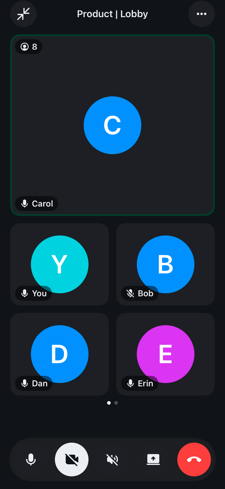

# Element Call for iOS

A native [MatrixRTC](https://github.com/matrix-org/matrix-spec-proposals/blob/main/proposals/4143-matrix-rtc.md)
call implementation for iOS: media, session, user interface and the Matrix side, built on
[matrix-rust-rtc](https://github.com/BillCarsonFr/matrix-rust-rtc).

<p align="center">
  
</p>

**This is not the web app, and not the embedded widget.** Three things share the Element Call name:

| Repository | What it is |
| --- | --- |
| [`element-call`](https://github.com/element-hq/element-call) | the Element Call web application |
| [`element-call-swift`](https://github.com/element-hq/element-call-swift) | that web application packaged for embedding in a web view |
| `element-call-ios` (this one) | a native iOS implementation, no web view involved |

## A note on how this was built

This package was written with **substantial AI assistance**, and the same is true of most changes to it.
Every line has been read and reviewed by a person before landing, it is covered by the tests described
below, and it has been exercised in real calls on real devices. Pull requests here carry the same
disclosure checkbox that element-x-ios uses.

We mention it because it is worth knowing when you read the code. Some of the comments are longer than
you might expect: where a decision is not obvious from the code, the reason it was made is written
down next to it, including the ones that were got wrong first. [AGENTS.md](AGENTS.md) records the
constraints an agent working here must not break.

## Modules

| Module | Contents | Depends on |
| --- | --- | --- |
| `ElementCallKit` | Capture, render, packers, audio engine, key handling. | the RTC core |
| `ElementCall` | Call lifecycle, spotlight, Picture in Picture, and the ports. | nothing |
| `ElementCallUI` | Stage, tiles, controls, minimized bar. | design tokens |
| `ElementCallMatrix` | A ready-made Matrix transport over the Rust SDK. | the Matrix SDK |

`ElementCallMatrix` is the only module that knows the Matrix SDK exists, and SwiftLint enforces that.

There is also an **`ElementCallAll`** product, which re-exports all four. A host that wants the whole
thing takes that one dependency and writes one `import ElementCallAll`; the four remain published, so
a host that only wants the media layer can still depend on `ElementCallKit` alone.

## Integrating

Add it as a source dependency, pinned to an exact version:

```swift
.package(url: "https://github.com/element-hq/element-call-ios", exact: "0.1.0-rc.1")
```

```yaml
# Or, in an XcodeGen project.yml
ElementCall:
  url: https://github.com/element-hq/element-call-ios
  exactVersion: 0.1.0-rc.1
```

Exactly, not a range: a renamed accessibility identifier is a breaking change, and at `0.x` the ports
are still moving. Releases are described in [RELEASING.md](RELEASING.md).

Then give it an SDK `Client` and a handful of small conformances, and you get a call.

```swift
let stack = ElementCallStack(transport: ElementCallSDKTransport(client: client, logger: logger)!,
                             system: MyCallKitAdapter(),
                             options: MyOptions(),
                             style: ElementCallStyle(theme: MyTheme(),
                                                     icons: MyIcons(),
                                                     avatars: MyAvatars()),
                             logger: logger)
await stack.start()
```

Then start a call and present the screen:

```swift
stack.controller.startCall(ElementCallData(isAudioCall: false, isStartingCall: true),
                           room: MyRoomContext(roomID: roomID))

ElementCallScreen(viewModel: ElementCallScreenViewModel(controller: stack.controller))
```

Build the stack **when the session is created, not when a call starts**. To-device delivery has no
catch-up, so a stack that subscribes only after its own membership has gone out can miss keys sent in
that window. Peers re-distribute on join, usually minting a fresh key, so a late start recovers rather
than breaking, but avoiding the race means the first frames decrypt instead of arriving black for a
moment.

### What the host provides

| Port | What you supply | Turnkey? |
| --- | --- | --- |
| `ElementCallMatrixTransport` | every Matrix send and feed | **yes**, use `ElementCallSDKTransport` |
| `ElementCallSystemProviding` | CallKit, plus audio-session and mute events coming back | no |
| `ElementCallRoomContext` | room display name, direct flag, member profiles | no |
| `ElementCallAvatarRendering` | avatar views, so they match your app | no |
| `ElementCallTheme`, `ElementCallIconRendering` | colours, fonts and icons | defaults to the real Compound tokens |
| `ElementCallOptions`, `ElementCallLogging`, `ElementCallStrings` | feature flags, a log sink, localised text | defaults provided |

The four that are not turnkey are the ones only a host can answer. CallKit is process-wide and usually
shared with something else. Room metadata and avatars come from whatever caching layer the host
already has, and what to call a room with no name is a product decision.

Every port has a fake shipped alongside it, so previews and tests need no host at all.

### Theming, and why it is a port

Colours and fonts are **computed properties read at draw time**, never captured once. Element's design
system keeps its colours on a single shared instance that can be re-branded at runtime, so a snapshot
taken at construction would leave the call screen on stock colours while the rest of the app changed.

With no theme supplied, the package uses the real
[Compound design tokens](https://github.com/element-hq/compound-design-tokens), which is a small
package of static values with no such instance.

### Why it must be a source dependency

This said, for a while, that a prebuilt binary "would embed its own copy of the design system and
never see the override". That does not follow, and it is worth correcting rather than quietly deleting,
because it is the answer someone will reach for next time: the override travels through the
`ElementCallTheme` **port**, which is a protocol, and a protocol crosses a binary boundary perfectly
well. `CompoundDesignTokens` is static values, so a duplicated copy costs binary size, not colours.

The real reason is in `Package.swift`. `ElementCallSDKTransport.init?(client:)` takes a
`MatrixRustSDK.Client`, so that module appears in the module interface — and the manifest declares
`MatrixRustSDK` as a deliberately wide `"26.09.01" ..< "100.0.0"` because pinning it exactly "forces
every consumer onto that version, so resolution fails the moment a host bumps the SDK before this
package cuts a release". A prebuilt binary is compiled against whichever SDK version CI happened to
have, of a Rust-generated API that turns over monthly, which re-imposes exactly that coupling.

[RELEASING.md](RELEASING.md#why-there-are-no-artifacts-on-the-release-page) has the rest, including the
one thing that would justify revisiting it.

### Two host build requirements

1. **Add `-ObjC` to your app target's other linker flags.** The RTC core links libwebrtc as a static
   archive, and its Objective-C categories are dead-stripped without the flag, so the app builds and
   then aborts at runtime with an unrecognised selector. Measured cost: 15.7 MiB on the linked
   binary, a 10.4% increase, essentially all of it libwebrtc's Objective-C surface. `-force_load` on
   the archive is not a smaller alternative, since it loads every object rather than only the
   Objective-C ones.
2. **Exclude the Intel simulator slice**, with `EXCLUDED_ARCHS[sdk=iphonesimulator*] = x86_64`. The
   media xcframework ships device and Apple Silicon simulator slices only, and a package cannot
   declare this for the projects that consume it.

## Development

```bash
brew install swiftformat swiftlint sourcery git-lfs
git lfs install --local
swift build
```

Tests need a simulator, the `-ObjC` flag and a fixed locale. See
[CONTRIBUTING.md](CONTRIBUTING.md#tests).

## Copyright & License

Copyright (c) 2026 Element Creations Ltd.

This software is dual licensed by Element Creations Ltd (Element). It can be used either:

(1) for free under the terms of the GNU Affero General Public License (as published by the Free
Software Foundation, either version 3 of the License, or (at your option) any later version); OR

(2) under the terms of a paid-for Element Commercial License agreement between you and Element (the
terms of which may vary depending on what you and Element have agreed to).

Unless required by applicable law or agreed to in writing, software distributed under the Licenses is
distributed on an "AS IS" BASIS, WITHOUT WARRANTIES OR CONDITIONS OF ANY KIND, either express or
implied. See the Licenses for the specific language governing permissions and limitations under the
Licenses.
